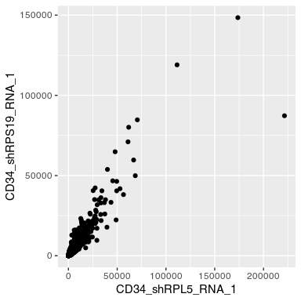

TFCB 2019: Homework 2
=====================

In this homework, we will work through a series of manipulations to analyze
a recently published deep sequencing dataset using `tidyverse` functions.

In the process, we will learn some new functions in `tidyverse` and apply
them to our data analysis.

For more information about the data used in this homework, please see
[this page](https://www.ncbi.nlm.nih.gov/geo/query/acc.cgi?acc=GSE89183).

You may find [RStudio's cheatsheets](https://rstudio.com/resources/cheatsheets/)
for data manipulation and data visualization useful, as well as
[this information](https://support.rstudio.com/hc/en-us/articles/200532077-Version-Control-with-Git-and-SVN)
about integrating Git/GitHub with RStudio.

**This assignment is due at 12pm on Oct 22, 2019. Your responses should be submitted
through the private repository created via GitHub Classroom using the link emailed to
you. See the note at the bottom of this document for more information on formatting your final submission.**

-   [Problem 1](#problem-1)
-   [Problem 2](#problem-2)
-   [Problem 3](#problem-3)
-   [Problem 4](#problem-4)
-   [Problem 5](#problem-5)
-   [Problem 6](#problem-6)
-   [Problem 7](#problem-7)
-   [Problem 8](#problem-8)
-   [Problem 9](#problem-9)
-   [Problem 10](#problem-10)

``` r
library(tidyverse)
```

## Problem 1

**10 points**

For each of the following functions, provide a <100 character description
(in your own words) and a URL reference.

1. `!`
2. `is.na`
3. `is.numeric`
4. `anti_join`
5. `desc`
6. `slice`
7. `all_vars`
8. `funs`
9. `filter_if`
10. `mutate_if`

## Problem 2

**10 points**

Add a comment above each code line below explaining what the code line does and/or why
that code line is necessary.

Keep each comment to less than 2 lines per line of code and < 80 chars per line.

```{r}
annotations <- read_tsv("ftp://ftp.ebi.ac.uk/pub/databases/genenames/new/tsv/locus_groups/protein-coding_gene.txt") %>%
  select(ensembl_gene_id, symbol, name, gene_family, ccds_id) %>%
  filter(!is.na(ccds_id)) %>%
  print()
```

```{r}
data <- read_tsv("ftp://ftp.ncbi.nlm.nih.gov/geo/series/GSE89nnn/GSE89183/suppl/GSE89183_Counts.txt.gz") %>%
  rename(ensembl_gene_id = `ENSEMBL gene`) %>%
  print()
```

## Problem 3

**10 points**

Using the code below:

1. Convert both axes to `log10` instead of linear scales.
2. Show axis tick labels as 10^0^, 10^1^, 10^2^,10^3^, 10^4^, 10^5^ for both axes.
3. There are two many points overlapping in certain regions. Use a different
`geom_` function to convey to your reader how many overlapping points are present
in each region.

```{r, fig.width=4, fig.height=4}
data %>%
  select(CD34_shRPL5_RNA_1, CD34_shRPS19_RNA_1) %>%
  ggplot(aes(x = CD34_shRPL5_RNA_1, y = CD34_shRPS19_RNA_1)) +
  geom_point()
```


**In problems 4 through 6, assign the result of your operation back to the `data`
variable.**

## Problem 4

**10 points**

Write a code chunk to select the following columns
from the `data` variable you created above
and reassign back to `data`.

`ensembl_gene_id`,
`CD34_shRPL5_RPF_1`, `CD34_shRPL5_RPF_2`, `CD34_shRPL5_RNA_1`, `CD34_shRPL5_RNA_2`,
`CD34_shRPS19_RPF_1`, `CD34_shRPS19_RPF_2`, `CD34_shRPS19_RNA_1`, `CD34_shRPS19_RNA_2`,
`CD34_shLuc_RPF_1`, `CD34_shLuc_RPF_2`, `CD34_shLuc_RNA_1`, `CD34_shLuc_RNA_2`.

## Problem 5

**10 points**

Write a code chunk to filter the result from Problem 4 to include
only rows where each of the 12 numerical columns
you selected has 50 counts or more  and reassign back to `data`.
This is a simple way to avoid genes that have
very low counts. You might be tempted to do this step separately for
each of the 12 columns, but
you will receive 5 bonus points if you instead use the `filter_if`
and `all_vars` functions you learned above.

## Problem 6

**10 points**

Write a code chunk to divide each of the 12 numerical columns by the
corresponding median value for each column
and reassign back to `data`. This median normalization is typically done in
high-throughput experiments after filtering
to normalize for sample-to-sample difference in read depth.
Again, you can write lot less code if you use the `mutate_if` and `funs` functions
you learned above.

## Problem 7

**10 points**

After we do the above filtering and median-normalization, let us calculate
translation efficiency as the average ratio of the RPF and RNA reads for each
treatment condition. Then we calculate how this translation efficiency changes
between target (`rpl5` and `rps19`) and control (`luc`) shRNAs.

The code implementing the above steps is shown below, but it has a few
errors. Correct them.

```{r}
lfc <- data %>%
  mutate(mean_rpl5_te = ((CD34_shRPL5_RPF_1 + CD34_shRPL5_RPF_2) /
                            (CD34_shRPL5_RNA_1 + CD34_shRPL5_RNA_2)) %>%
  mutate(mean_rps19_te = ((CD34_shRPS19_RPF_1 + CD34_shRPS19_RPF_2) /
                            (CD34_shRPS19_RNA_1 + CD34_shRPS19_RNA_2)) %>%
  mutate(mean_shluc_te = ((CD34_shLuc_RPF_1 + CD34_shLuc_RPF_2) /
                            (CD34_shLuc_RNA_1 + CD34_shLuc_RNA2)) %>%
  select(ensembl_gene_id, mean_rpl5_te, mean_rps19_te) %>%
  mutate(lfc_te_rpl5 == log2(mean_rpl5_te / mean_shluc_te),
         lfc_te_rps19 == log2(mean_rps19_te / mean_shluc_te)) %>%
  print()
```

## Problem 8

**10 points**

Write code that will create a new dataframe called `mean_lfc` from `lfc`
containing a new column called `avg_lfc`.
`avg_lfc` should be the average of the log2 fold-change in TE (`lfc_te`) upon
knockdown of RPL5 and RPS19.

Then select only the gene id column and the new column that you just created
(this will be your new dataframe `mean_lfc`).

## Problem 9

**10 points**

Write code to join the `mean_lfc` dataframe with the `annotations` dataframe created
at the top of the document and assign back to `mean_lfc`.

## Problem 10

**10 points**

1. Write code to select only the bottom 10 genes with the
lowest `avg_lfc` and display the
gene `symbol`, gene `name` and `avg_lfc` for these genes.
2. Create a figure using ggplot to visualize these results.
Write a few sentences to justify the choices you made when creating your figure.

**When you are satisfied with your code and answers,
use the "Knit" button in RStudio to create the final set of files.
that you may then commit to your private repo and push to GitHub for grading.
Please inspect the files after pushing to GitHub to ensure
your code and figures are rendering as you expect.**
